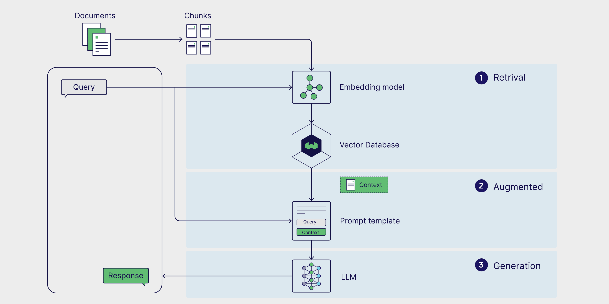
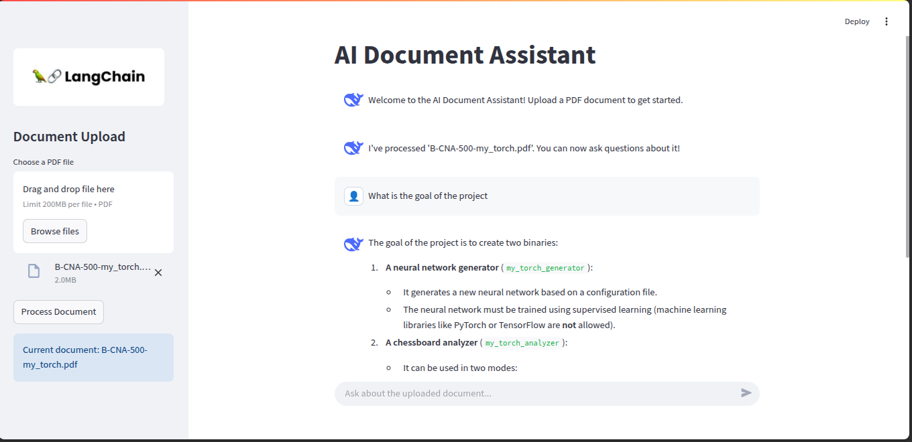

# Retrieval-Augmented Generation Workshop

This workshop demonstrates how to build an intelligent document Q&A system using Retrieval-Augmented Generation (RAG).

## What is RAG and Why It's Important ?
RAG is a framework that combines information retrieval with text generation to create AI systems that produce more accurate, factual, and contextually relevant responses.

### How RAG Works
1. Retrieval Phase: When a user asks a question, RAG first searches through a knowledge base (documents, databases, etc.) to find the most relevant information.

2. Augmentation Phase: The retrieved information is injected as context into the prompt sent to a large language model (LLM).

3. Generation Phase: The LLM generates a response based on both its pre-trained knowledge and the specific retrieved context.



## Why RAG is Important

1. Improved Accuracy: By grounding responses in specific source material, RAG reduces hallucinations and factual errors common in pure LLM responses.

2. Up-to-date Information: RAG can access the latest information from your documents, overcoming the limitation of LLMs being trained on older data.

3. Domain Specificity: Enables LLMs to answer questions about specialized or proprietary information not present in their training data.

4. Source Attribution: RAG can provide references to the source documents, increasing transparency and trustworthiness.

5. Lower Costs: Smaller, more efficient models can be used since they're augmented with external knowledge rather than needing to memorize everything.

6. Privacy & Control: Organizations can keep sensitive information in their own knowledge base rather than sending it to external LLM providers.

RAG represents an important evolution in AI systems, creating a bridge between traditional search and modern generative AI to deliver more reliable and useful responses.


## Workshop/Project Overview

This project implements a RAG-based system that allows users to:
1. Upload PDF documents
2. Process them into searchable vector stores
3. Ask questions about the documents using natural language
4. Receive contextually relevant answers based on the document content

## Features

- **PDF Document Processing**: Upload and process PDF documents 
- **Vector Embedding**: Convert document chunks into embeddings using Hugging Face models
- **Intelligent Retrieval**: Find the most relevant document sections for user queries
- **Natural Language Responses**: Generate human-like responses using Large Language Models
- **Interactive UI**: Easy-to-use Streamlit interface for document uploading and querying

## Architecture

The project consists of three main components:

1. **Core RAG Engine** (core.py):
   - Document loading and chunking
   - Vector embedding generation
   - Retrieval system
   - LLM integration

2. **Web Interface** (streamlit_app.py):
   - Document upload interface
   - Chat interface for asking questions
   - Session state management

3. **Colab Notebook** (RAG_(Retrieval_Augmented_Generation).ipynb):
   - Step-by-step tutorial implementation
   - Detailed explanations of each RAG component
   - Executable demonstration

## Getting Started

### Prerequisites

- Python 3.13+
- HuggingFace account and API token
- DeepSeek API key (or compatible LLM API)

### Installation

1. Clone the repository:
   ```
   git clone https://github.com/AnalyticAce/Retrieval-Augmented-Generation-Workshop.git
   cd Retrieval-Augmented-Generation-Workshop
   ```

2. Install dependencies:
   ```
   pip install -r requirements.txt
   ```

3. Create a .env file with your API keys:
   ```
   HF_TOKEN="your_huggingface_token"
   DEEPSEEK_API_KEY="your_deepseek_api_key"
   DEEPSEEK_API_BASE="https://api.deepseek.com/v1"
   ```

### Running the Application

Start the Streamlit web interface:
```
streamlit run streamlit_app.py
```

## Usage

1. Open the web interface in your browser (typically http://localhost:8501)
2. Upload a PDF document using the sidebar
3. Click "Process Document" to analyze the document
4. Ask questions in the chat interface
5. View the AI-generated answers based on document content

### Streamlit UI


## Technical Details

- **Document Chunking**: Uses RecursiveCharacterTextSplitter with chunk size of 10,000 characters
- **Embeddings**: Generated using Hugging Face's "all-MiniLM-L6-v2" model
- **Vector Database**: FAISS for efficient similarity search
- **LLM**: DeepSeek Chat model (can be configured to use other LLMs)
- **Framework**: Built on LangChain for component orchestration

## Workshop Content

The colab notebook.ipynb walks through:

1. Environment setup and dependency installation
2. Data ingestion and preprocessing techniques
3. Vector store creation with different embedding options
4. LLM configuration and RAG chain setup
5. Query processing and response generation

## License

This project is licensed under the MIT License - see the LICENSE file for details.

## Authors

| [<br><sub>DOSSEH Shalom</sub>](https://github.com/AnalyticAce) |
| :---: |

> 🚀 Don't hesitate to put a star 🌟 on `HubEpitechBenin's` repositories and follow the author of this workshop :) .